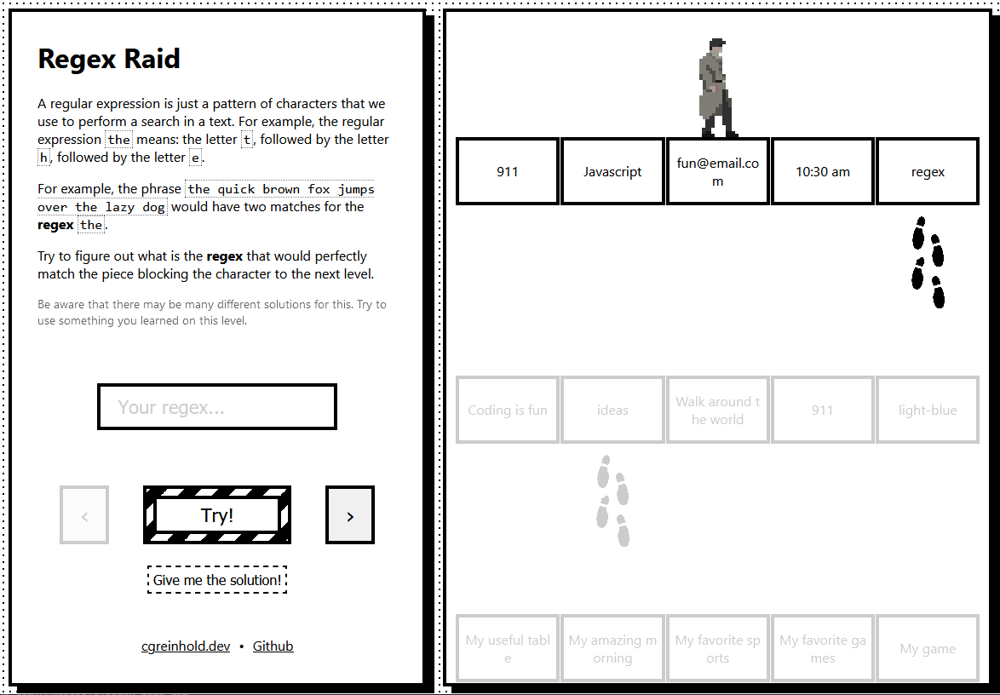

# Regex Mistery

This is a game created to teach some regex concepts.

Try to figure out the valid regex necessary to advance to next levels and reach to the end.

Each level exposes a different regex challenge.

[You can try the live version here](https://regex-mistery.cgreinhold.dev/)

If you find any bug or problem, please open a issue, or help me evolve the game creating a PR.
